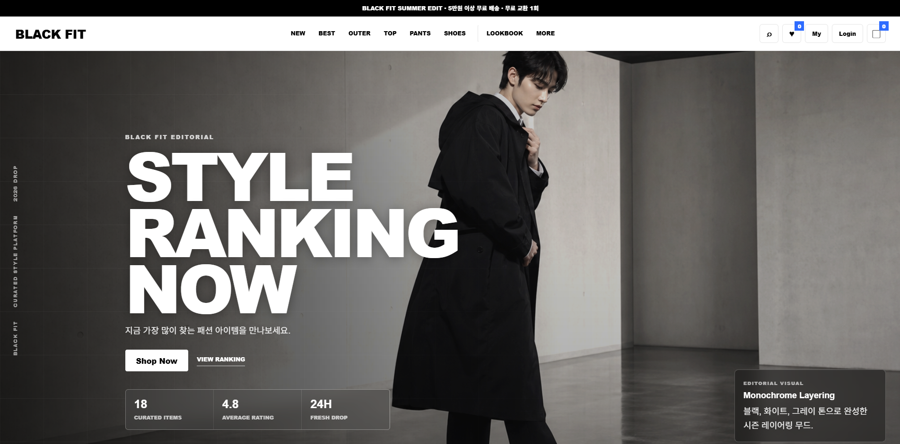
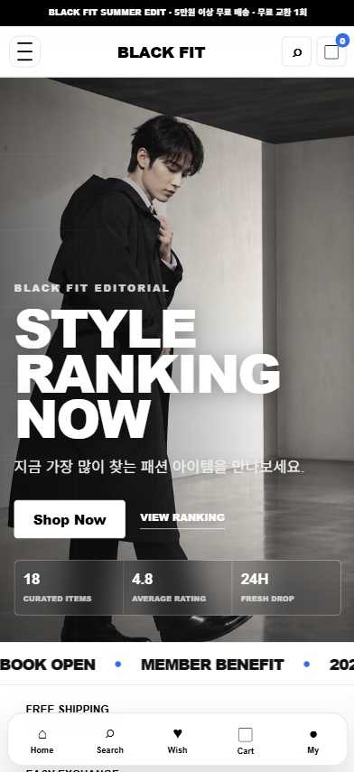
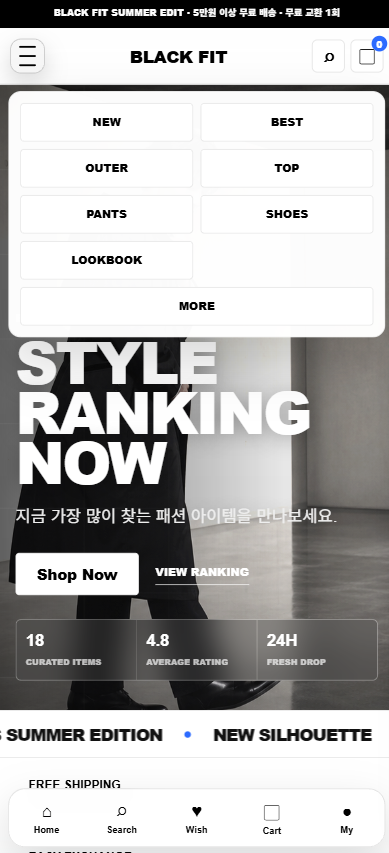
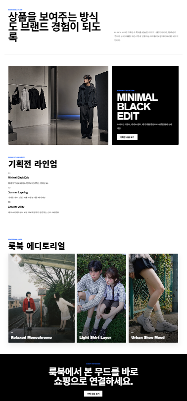

# BLACK FIT

BLACK FIT은 포트폴리오 제출을 목적으로 제작한 패션 커머스 웹사이트입니다. 블랙/화이트 중심의 미니멀한 무드, 큰 타이포그래피, 상품 이미지 중심의 그리드, 모바일 쇼핑앱에 가까운 인터랙션을 목표로 설계했습니다.

프론트엔드는 HTML, CSS, Vanilla JavaScript만 사용했습니다. 상품 탐색부터 상세 확인, 옵션 선택, 장바구니 담기, 주문 완료, 관리자 상품/주문 관리까지 실제 커머스 흐름처럼 동작하도록 구성했습니다. 추가로 `backend/` 폴더에는 Python FastAPI 기반 API 서버를 넣어, 상품/주문/로그인 데이터를 서버 구조로 확장할 수 있음을 보여줍니다.

## Preview

아래 이미지는 포트폴리오 README에서 보여줄 화면 캡처입니다. 이미지를 직접 캡처해서 아래 경로와 파일명으로 저장하면 README에 자동으로 표시됩니다.

```text
images/readme/preview-desktop-home.png
images/readme/preview-mobile-home.png
images/readme/preview-mobile-menu.png
images/readme/preview-lookbook.png
```



| Mobile Home | Mobile Menu |
| --- | --- |
|  |  |



## Live Demo

- Vercel: https://shopping-mall-rosy.vercel.app/
- 로컬 백엔드 테스트: http://127.0.0.1:8000/docs

## 주요 기능

- 고정 헤더, 모바일 하단 내비게이션, 반응형 상품 그리드
- 메인 히어로, 랭킹 상품, 신상품, 브랜드 큐레이션, 룩북, 기획전 섹션
- 상품 리스트 카테고리 필터, BEST/NEW 필터, 가격 필터, 정렬, 검색
- 상품 카드 hover 이미지 전환, 찜 버튼, 빠른 상세 보기
- 상품 상세 모달, 이미지 갤러리, 사이즈 선택, 수량 선택, 리뷰 탭
- localStorage 기반 장바구니, 찜 목록, 최근 본 상품, 최근 검색어, 주문 내역 저장
- 장바구니 사이드 패널, 추천 상품, 쿠폰 코드, 배송비/총액 계산
- 로그인/로그아웃, 관리자 계정, 상품 추가/수정/삭제, 주문 상태 변경/삭제
- 룩북, 브랜드, 이벤트, 검색, 마이페이지, 고객지원 서브페이지
- favicon, Apple Touch Icon, Android Web App Manifest 적용
- Python FastAPI 백엔드 API: 상품, 주문, 로그인, 문의, 뉴스레터

## 사용 기술

- HTML5
- CSS3
- Vanilla JavaScript
- localStorage
- Python
- FastAPI
- JSON file storage

## 프로젝트 구조

```text
BLACK FIT
├─ index.html              # 메인 쇼핑몰 페이지
├─ style.css               # 전체 UI, 반응형, 인터랙션 스타일
├─ script.js               # 상품/장바구니/로그인/관리자 기능
├─ pages.js                # 서브페이지 렌더링 스크립트
├─ lookbook.html           # 룩북/기획전 페이지
├─ brand.html              # 브랜드 큐레이션 페이지
├─ event.html              # 이벤트/쿠폰 페이지
├─ product.html            # 상품 상세 서브페이지
├─ search.html             # 검색 페이지
├─ mypage.html             # 마이페이지
├─ support.html            # 고객지원 페이지
├─ images/
│  ├─ products/            # 상품 이미지와 hover 모델 이미지
│  ├─ favicons/            # PC/모바일 파비콘 및 앱 아이콘
│  └─ readme/              # README 화면 캡처 이미지
└─ backend/
   ├─ app.py               # FastAPI 서버
   ├─ requirements.txt     # Python 의존성
   └─ data/                # 실행 시 JSON 저장소 생성
```

## 프론트엔드 실행

정적 사이트이므로 `index.html`을 브라우저에서 열어 바로 확인할 수 있습니다.

Vercel 배포 시 설정:

- Framework Preset: `Other`
- Build Command: 비워두기
- Output Directory: 비워두기

## Python 백엔드 실행

Python 3.12 사용을 권장합니다.

```powershell
cd "C:\Users\i5E-\Desktop\쇼핑몰"
py -3.12 -m venv .venv
.\.venv\Scripts\python.exe -m pip install -r backend\requirements.txt
.\.venv\Scripts\python.exe -m uvicorn backend.app:app --reload --port 8000
```

실행 후 접속:

- 웹사이트: http://127.0.0.1:8000/index.html
- API 문서: http://127.0.0.1:8000/docs
- 상태 확인: http://127.0.0.1:8000/api/health

## 관리자 계정

```text
아이디: admin
비밀번호: admin
```

## 포트폴리오 소개 문구

BLACK FIT은 Vanilla JavaScript 기반의 패션 커머스 프론트엔드 프로젝트입니다. 상품 탐색, 상세 모달, 옵션 선택, 장바구니, 주문, 관리자 관리 기능을 localStorage 기반으로 구현했으며, Python FastAPI 백엔드를 추가해 상품/주문/관리자 API 구조까지 확장했습니다.
