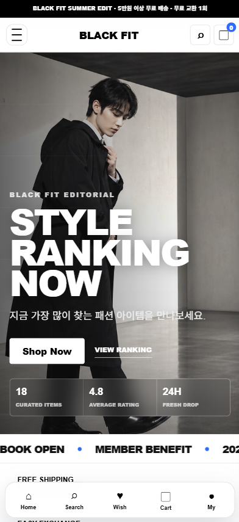
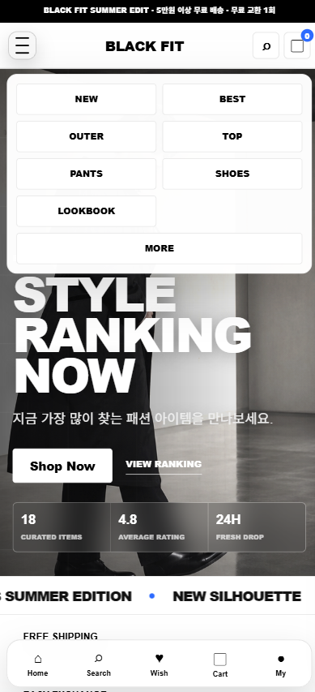
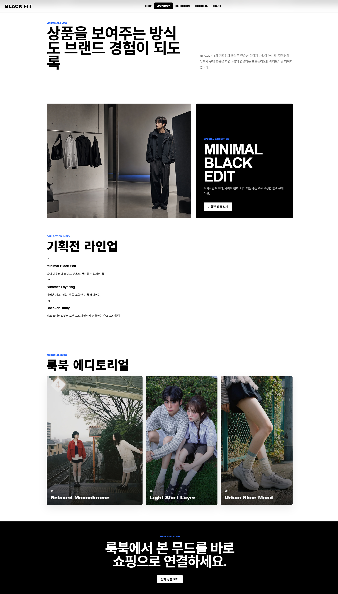

# BLACK FIT

BLACK FIT은 포트폴리오 제출을 목적으로 제작한 패션 커머스 웹사이트입니다. 블랙/화이트 중심의 미니멀한 무드, 큰 타이포그래피, 상품 이미지 중심의 그리드, 모바일 쇼핑앱에 가까운 인터랙션을 목표로 설계했습니다.

프론트엔드는 HTML, CSS, Vanilla JavaScript만 사용했습니다. 상품 탐색부터 상세 확인, 옵션 선택, 장바구니 담기, 모의 주문, 관리자 상품/주문 관리까지 연결했습니다. 프론트엔드는 브라우저 내부 데모이며 실제 결제·배송은 진행되지 않습니다. `backend/`의 Python FastAPI API는 별도 확장 예제이며 프론트엔드의 주문·관리자 기능과 자동 연동되어 있지 않습니다. 공통 `catalog.json`을 기본 상품 데이터로 사용하지만 브라우저 저장소와 서버 저장소는 별개입니다.

## Preview

아래 이미지는 개선 전 캡처입니다. 브랜드 분위기는 유지하되 실제 화면의 섹션 순서와 일부 컨트롤은 달라졌습니다.


| Mobile Home | Mobile Menu |
| --- | --- |
|  |  |



## Live Demo

- Vercel: https://shopping-mall-rosy.vercel.app/
- 로컬 백엔드 테스트: http://127.0.0.1:8000/docs

## 주요 기능

- 고정 헤더, 모바일 하단 내비게이션, 반응형 상품 그리드
- 메인 히어로, 랭킹 상품, 신상품, 브랜드 큐레이션, 룩북, 기획전 섹션
- 상품 리스트 카테고리 필터, BEST/NEW 필터, 가격 필터, 정렬, 검색, 결과 개수와 필터 초기화
- 상품 카드 hover 이미지 전환, 찜 버튼, 빠른 상세 보기
- 상품 상세 모달·상세 페이지, 해당 상품 이미지 갤러리, 사이즈/재고 선택, 수량 선택, 리뷰 탭
- 모달·상세 페이지 공통 상품 설명·소재·핏·관리 방법·실측 표, 선택 옵션·수량별 금액 표시
- 관리자에서 상세 정보·추가 이미지·사이즈별 실측 입력, 대표 상품 10개 큐레이션 설명
- localStorage 기반 장바구니, 찜 목록, 최근 본 상품, 최근 검색어, 주문 내역 저장
- 장바구니 사이드 패널, 옵션 변경, 추천 상품, 쿠폰 코드, 5만원 이상 무료배송/총액 계산
- 로그인/로그아웃, 관리자 계정, 상품 추가/수정/삭제, 주문 상태 변경/삭제
- 비회원 주문 확인, 상품·할인·배송비 상세 금액, 배송 준비 전 주문 취소와 옵션별 재고 복구
- 배송 완료 후 7일 이내 전체 주문 교환·반품 신청, 관리자 승인·반려·완료 처리와 상태 이력
- 룩북, 브랜드, 이벤트, 검색, 마이페이지, 고객지원 서브페이지
- favicon, Apple Touch Icon, Android Web App Manifest 적용
- Python FastAPI 백엔드 API: 상품, 모의 주문, 데모 로그인, 문의, 뉴스레터
- 서버 기준 주문 가격·쿠폰·재고 검증, JSON 파일 잠금과 원자적 저장

## 화면 표시 보완

- 메인 이미지는 상단 기준으로 배치하고 높이를 조정해 모델 얼굴이 잘리는 문제를 줄였습니다.
- 스크롤 등장 효과에 의존하던 콘텐츠 숨김을 제거해 상품과 브랜드 섹션을 항상 표시합니다.
- 큐레이션·룩북 이미지 영역과 제목 간격을 고정하고, 룩북의 불필요한 빈 행을 제거했습니다.
- 상품 상세의 옵션·배송 정보는 실제 항목 수에 맞춰 두 칸으로 표시합니다. 빈 안내 문구는 공간을 차지하지 않습니다.
- 상품 기본 이미지와 상세 이미지는 전체 이미지가 표시되도록 조정했습니다.

## 사용 기술

- HTML5
- CSS3
- Vanilla JavaScript
- localStorage
- Python
- FastAPI
- JSON file storage

## 프로젝트 구조

```text
BLACK FIT
├─ index.html              # 메인 쇼핑몰 페이지
├─ style.css               # 전체 UI, 반응형, 인터랙션 스타일
├─ catalog.json            # 프론트/백엔드 공통 기본 상품 42개
├─ store.js                # 공통 데이터 검증·브라우저 저장·배송 계산
├─ commerce.js             # 공통 상품 상세·실측·주문 생성·취소·교환·반품
├─ script.js               # 상품/장바구니/로그인/관리자 기능
├─ pages.js                # 서브페이지 렌더링 스크립트
├─ lookbook.html           # 룩북/기획전 페이지
├─ brand.html              # 브랜드 큐레이션 페이지
├─ event.html              # 이벤트/쿠폰 페이지
├─ product.html            # 상품 상세 서브페이지
├─ search.html             # 검색 페이지
├─ mypage.html             # 마이페이지
├─ support.html            # 고객지원 페이지
├─ images/
│  ├─ products/            # 상품 이미지와 hover 모델 이미지
│  ├─ favicons/            # PC/모바일 파비콘 및 앱 아이콘
│  └─ readme/              # README 화면 캡처 이미지
└─ backend/
   ├─ app.py               # FastAPI 서버
   ├─ requirements.txt     # Python 의존성
   └─ data/                # 실행 시 JSON 저장소 생성
```

## 프론트엔드 실행

상품 데이터를 `fetch`로 불러오므로 `file://`로 직접 열지 않고 HTTP 서버로 실행합니다.

```powershell
cd "C:\Users\DYU\Desktop\종안\포폴모음\쇼핑몰"
py -m http.server 8080 --bind 127.0.0.1
```

로컬 프론트엔드: http://127.0.0.1:8080/index.html

위 간단한 서버는 로컬 미리보기 전용입니다. 프로젝트 전체를 제공하므로 외부 공개에 사용하지 않습니다. Vercel 배포에서는 `.vercelignore`로 백엔드와 환경 파일을 제외합니다.

Vercel 배포 시 설정:

- Framework Preset: `Other`
- Build Command: 비워두기
- Output Directory: 비워두기

## Python 백엔드 실행

Python 3.12 사용을 권장합니다.

```powershell
cd "C:\Users\DYU\Desktop\종안\포폴모음\쇼핑몰"
py -3.12 -m venv .venv
.\.venv\Scripts\python.exe -m pip install -r backend\requirements.txt
.\.venv\Scripts\python.exe -m uvicorn backend.app:app --reload --port 8000
```

실행 후 접속:

- 웹사이트: http://127.0.0.1:8000/index.html
- API 문서: http://127.0.0.1:8000/docs
- 상태 확인: http://127.0.0.1:8000/api/health

## 프론트엔드 데모 관리자

```text
아이디: admin
비밀번호: admin
```

프론트엔드 계정은 UI 체험용이며 접근 권한을 보장하지 않습니다. 일반 로그인에는 임의의 값을 입력합니다. 백엔드 관리자 API는 기본 비활성화되어 있으며 `ADMIN_USER`, `ADMIN_PASSWORD` 환경 변수로 설정합니다. 기존 고정 관리자 토큰은 제거했습니다.

## 포트폴리오 소개 문구

BLACK FIT은 Vanilla JavaScript 기반의 패션 커머스 프론트엔드 프로젝트입니다. 상품 탐색, 상세 모달, 옵션 선택, 장바구니, 주문, 관리자 관리 기능을 localStorage 기반으로 구현했으며, 별도 Python FastAPI 백엔드로 상품/모의 주문/관리자 API와 서버 가격·재고 검증 구조를 구현했습니다.

## 데이터 및 보안 범위

### 상품 상세와 주문 이후 흐름

- 기존 42개 상품과 이미지 경로를 유지했습니다. 대표 상품 설명은 상품명에 근거한 큐레이션 문구이며 제조사 소재·세탁법·실측을 추정해 입력하지 않았습니다. 확인된 정보만 관리자에서 등록하며 빈 소재·핏·관리 항목은 화면에서 숨깁니다.
- 상세 모달과 개별 상품 페이지는 같은 설명·실측·이미지 갤러리 로직을 사용합니다. 추가 이미지는 기존 `images/` 경로 또는 HTTPS URL만 허용합니다.
- 주문서와 주문 상세에 상품·옵션·수량·할인·배송비·최종 금액을 표시합니다. 비회원도 현재 브라우저의 주문을 확인할 수 있으며 기존 화면용 로그인은 유지합니다.
- 결제완료 상태에서만 전체 주문 취소가 가능하며 재고는 한 번만 복구됩니다. 배송 상태는 결제완료 → 배송준비 → 배송중 → 배송완료 순서로 변경합니다.
- 새로 배송완료 처리한 주문의 완료 시각부터 7일 이내 교환·반품을 신청할 수 있습니다. 이전 주문에 완료일이 없다면 날짜를 임의 생성하지 않으며 신청을 제공하지 않습니다. 실제 배송일이나 결제 환불을 확인하는 기능은 아닙니다.
- 교환은 같은 상품의 사이즈 변경이며 전체 주문 단위로 접수합니다. 접수 시 재고를 확인하지만 예약하지는 않고, 관리자 승인 후 완료할 때 재확인·원래 옵션 복구·새 옵션 차감을 함께 저장합니다. 반품은 완료 시 전체 재고를 복구합니다. 접수·승인·완료·반려 이력을 표시합니다.
- 주문·교환에 사용된 상품과 옵션은 삭제를 제한합니다. 기본 상품 복원 시 주문 이력이 있는 상품의 현재 옵션·재고를 보존하며 주문 삭제는 취소·반품 완료 상태에 한정합니다.
- Web Locks 지원 브라우저에서는 주문 생성·취소·교환·반품 변경을 탭 간 직렬화합니다. 미지원 브라우저나 다른 코드의 저장까지 완전한 동시성·트랜잭션을 보장하지는 않습니다.
- 별도 FastAPI 서버는 이번에도 자동 연동하지 않았습니다. 실제 서버 연동은 배포 주소·주문 접근 권한·영속 저장 구조를 결정한 뒤 진행해야 합니다. 실제 결제·배송·환불·교환 택배 접수는 수행하지 않습니다.

- 기본 상품은 `catalog.json` 하나에서 읽습니다. 수정·삭제와 빈 상품 목록은 브라우저 저장소에 유지되고, 복원은 관리자 버튼으로만 실행합니다.
- 상품·장바구니·주문·찜은 이 브라우저에 저장됩니다. 주문 내역은 기기 내 공유 데모이며 회원별 보안 분리나 실제 인증을 제공하지 않습니다. 실제 개인정보와 비밀번호를 입력하지 않습니다.
- 주문에 수령인·연락처·주소·요청사항을 보관하며 완료 직전에 현재 가격과 재고를 확인합니다. 무료배송 기준은 쿠폰 차감 전 상품 금액 5만원입니다.
- 여러 저장 키의 변경을 묶고 저장 실패 시 가능한 범위에서 이전 값을 복원합니다. localStorage는 데이터베이스 트랜잭션이 아니므로 동시에 열린 탭에서의 완전한 원자성을 보장하지 않습니다. 실제 서비스는 서버 주문 API를 사용해야 합니다.
- 리뷰·검색어·상품명·회원명은 HTML로 출력하기 전에 이스케이프합니다. 상품 이미지는 `images/` 경로와 HTTPS URL만 허용합니다. 아이콘은 버전을 고정한 Lucide CDN을 사용합니다.
- 뉴스레터는 브라우저 내부 데모 저장만 수행하며 메일은 발송하지 않습니다. 리뷰와 평점은 데모 데이터입니다.
- 백엔드는 공개 HTML/JS/CSS/상품 JSON/이미지만 제공하며 서버 코드·데이터·Git·환경 파일은 제공하지 않습니다. 관리자 비밀번호는 환경 변수에서 읽고 무작위 관리자 토큰을 사용합니다. `ADMIN_TOKEN`을 설정하면 여러 프로세스에서 같은 키를 사용할 수 있습니다.
- API에는 요청 크기 64KiB, 원격 주소별 요청 제한, 입력 검증을 적용합니다. 제한 기본 저장소는 프로세스별 메모리이며 배포 시 프록시 정책 및 공유 저장소를 별도로 설정해야 합니다. CORS는 `ALLOWED_ORIGINS`에 지정한 출처만 허용합니다.
- 서버 JSON 저장은 파일 잠금으로 읽기·수정·쓰기를 보호하고 임시 파일 저장 후 교체합니다. 손상된 파일을 기본 데이터로 덮어쓰지 않습니다. 기존 ID 변경이 필요한 첫 업그레이드에는 `backend/data/store.before-upgrade.json`을 남기고 상품 이미지 기준으로 ID를 맞춥니다. 기존 상품·주문은 보존하며 삭제했던 상품은 자동 추가하지 않습니다.
- 백엔드 수정/삭제는 존재하지 않는 ID에 404를 반환합니다. 서버 주문은 요청에 포함된 가격·총액을 신뢰하지 않고 계산합니다. 실제 결제와 배송 처리, 회원 인증, 운영용 개인정보 보호는 별도 구현이 필요합니다.

이번 변경에서는 빌드·자동 테스트·배포 환경 동작 검증을 실행하지 않았습니다.

